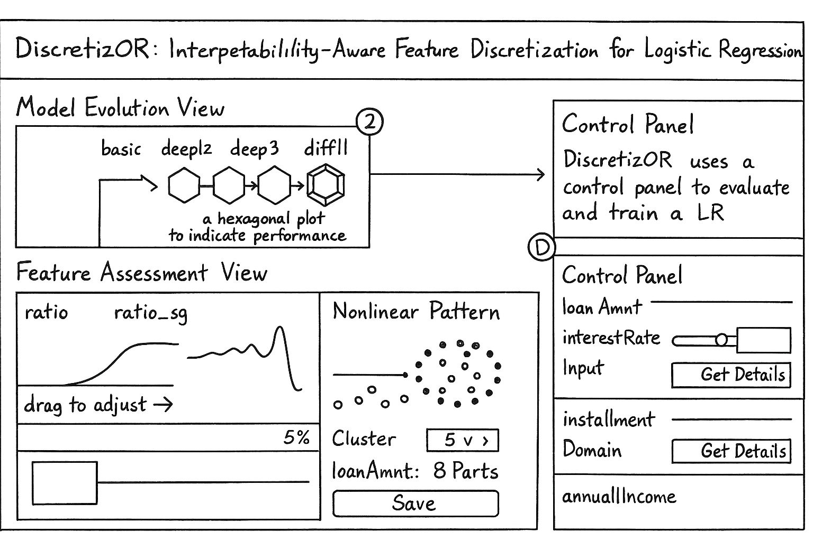

# Summer Research Project Plan

## 1. Task Definition and Objectives

Based on early-stage user interviews and [survey results](Interview%20with%20End%20Users/Interview%20with%20Ziming%20Yu/Survey%20Analysis.md), the project aims to address the following core tasks:

1. Enable interpretability-aware feature selection in logistic regression workflows.  
2. Identify and refine nonlinear patterns through interactive feature discretization schemes.  
3. Support agile building, comparison, and management of logistic regression (LR) instances.

---

## 2. Review of Related Work

### 2.1 Interactive Feature Selection

- Seo, J., & Shneiderman, B. (2004). A rank-by-feature framework for unsupervised multidimensional data exploration using low-dimensional projections. *IEEE Symposium on Information Visualization*, 65–72.
- Johansson, S., & Johansson, J. (2009). Interactive dimensionality reduction through user-defined combinations of quality metrics. *IEEE Transactions on Visualization and Computer Graphics*, 15(6), 993–1000.

### 2.2 Visual Analysis for Machine Learning

- Yue, X., Gu, Q., Wang, D., Qu, H., & Wang, Y. (2021). iQUANT: Interactive quantitative investment using sparse regression factors. *Computer Graphics Forum*, 40(3), 189–200.
- Horvitz, E. (1999). Principles of mixed-initiative user interfaces. *Proceedings of the SIGCHI Conference on Human Factors in Computing Systems*, 159–166.
- Wang, Z. J., et al. (2021). CNN Explainer: Learning convolutional neural networks with interactive visualization. *IEEE Transactions on Visualization and Computer Graphics*, 27(2), 1396–1406.

---

## 3. System Development Phase

This stage involves iterative implementation of the DiscretizOR system through close collaboration with an industry data science team.

- **Planned Duration**: 3 weeks  
- **Timeline**:
  - **Commencement**: June 23, 2025  
  - **Completion**: July 13, 2025  
- **Collaborative Partner**: Industrial research and development group

---

## 4. Case Study and Documentation

Following system completion, a formal case study will be conducted using real-world data. Insights will be compiled into a final project report.

- **Start Date**: July 14, 2025  
- **End Date**: July 21, 2025  
- **Deliverable**: Final case study analysis and written report

---

## 5. Timeline Overview

| Project Phase                | Start Date   | End Date     | Duration        |
|-----------------------------|--------------|--------------|-----------------|
| Background Research & Tasks | June 4, 2025 | June 25, 2025| ~3 weeks        |
| System Design               | June 26, 2025| July 6, 2025 | ~1.5 weeks      |
| System Development          | July 7, 2025 | July 27, 2025| 3 weeks         |
| Case Study & Report Writing | July 28, 2025| Aug 4, 2025  | 1 week          |
