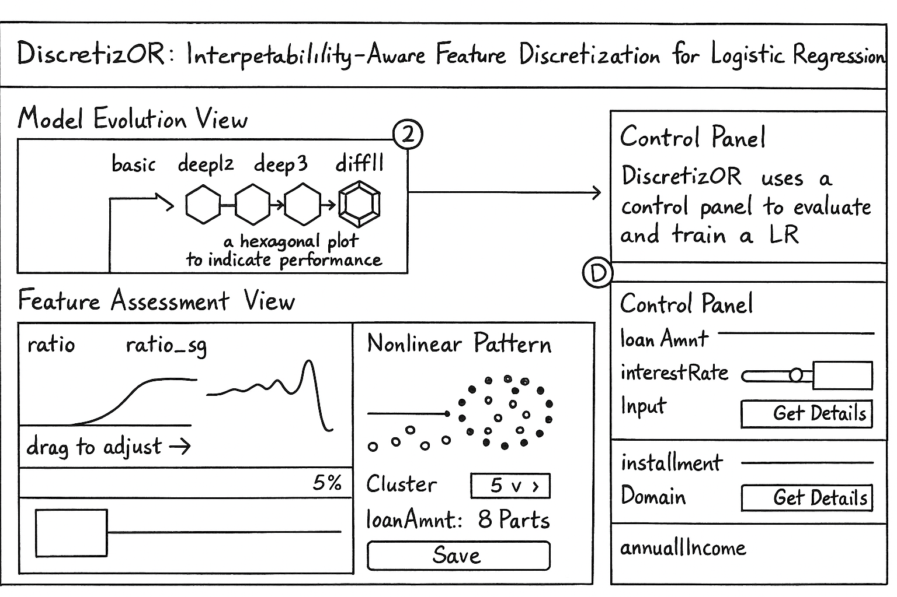
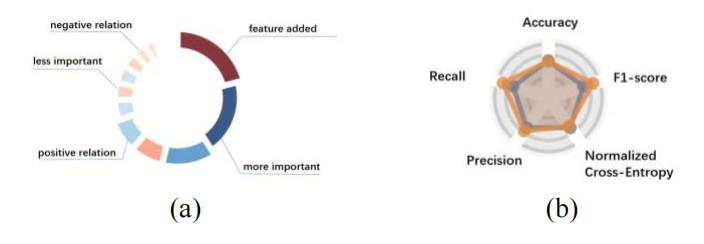

# System Development Progress
My development will be based on this design sketch, and I will keep updating my progress here.
I will document my design and development process, which will eventually become part of my summer project report.

## System Development
### Revolution View
In the last 2 weeks, I developed the `Revolution View` of the System.

The view was designed to support users for interpretability feature selection and manage multiple instances generated from different 
input schemes. In working closely with data scientists, I found that many experienced data scientists resort to tree diagram to document 
their instances. And after communication, I found that data scientists are more interested in the impact of current input schemes. In other words, they hope the differences in the performance of neighboring models can be emphasised.

Composite graphic is visual encoding of LR instance. In addition to providing the function of selecting node, the text element obviously shows the name of the LR instance. The outer ring (a) is the core component of the composite graph, each segment of which represents a corresponding feature inputted. The size of it represents the relative contribution of the feature to the instance, reflecting the importance while the color depth represents the absolute strength of the feature's effect. We also use blue to encode the positive correlation between features and classification results, and red to express the negative. That is, if the feature corresponds to a segment is blue, the more likely the classification result is positive when the value of the feature is larger. And red expresses the opposite meaning. Further, when any LR instance that is not a parent node is visualized, the features that are added over the input scheme of parent will be highlighted in a magnified form. Through the design of this component, data scientists can visually observe the relative importance and effect strength structure of the features in each model instance. In addition, data scientists are able to very naturally select those features that have a significant impact on the classification result for further analysis.

## References

[1] Jundong Li, Kewei Cheng, Suhang Wang, Fred Morstatter, Robert P. Trevino, Jiliang Tang, and Huan Liu,  
“**Feature Selection: A data perspective**,” *ACM Computing Surveys*, vol. 50, no. 6, pp. 1–45, November 2018.

[2] Jinwook Seo, and Ben Shneiderman,  
“**A rank-by-feature framework for unsupervised multidimensional data exploration using low dimensional projections**,”  
in *Information Visualization, IEEE Symposium on*, 2004, pp. 65–72.

[3] Sara Johansson, and Jimmy Johansson,  
“**Interactive dimensionality reduction through user-defined combinations of quality metrics**,”  
*IEEE Transactions on Visualization and Computer Graphics*, vol. 15, no. 6, pp. 993–1000, October 2009.

[4] Shangsong Liu, Di Peng, Haotian Zhu, Xiaolin Wen, Xinyi Zhang, Zhenghao Zhou, and Min Zhu,  
“**MulUBA: Multi-level visual analytics of user behaviors for improving online shopping advertising**,”  
*Journal of Visualization*, vol. 24, no. 6, pp. 1287–1301, August 2021.

[5] Thorsten May, Andreas Bannach, James Davey, Tobias Ruppert, and Jörn Kohlhammer,  
“**Guiding feature subset selection with an interactive visualization**,”  
in *2011 IEEE Conference on Visual Analytics Science and Technology (VAST)*, 2011, pp. 111–120.

[6] Hyunseung Bang, and Daniel Selva,  
“**iFEED: Interactive feature extraction for engineering design**,”  
in *ASME 2016 International Design Engineering Technical Conferences and Computers and Information in Engineering Conference*, 2016, pp. V007T06A037.

